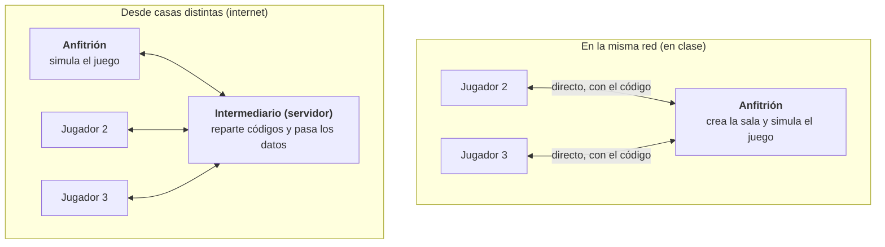

# Vacío — Modo multijugador: viabilidad

*Estudio del 9 de octubre de 2026. Valorado, todavía no empezado.*

Es viable jugar 2 o 3 personas en cooperativo desde ordenadores distintos, creando una sala con un código y entrando con él. Es el cambio más grande del proyecto: en la misma red no hace falta servidor, pero por internet sí hace falta uno que haga de intermediario.

## Cómo se conectan los ordenadores

Depende de si estáis en la misma red o en casas distintas. En clase, el anfitrión crea la sala y los demás se conectan directamente con el código; Godot lo trae de serie. Desde casas distintas, los routers no dejan conectarse directamente a otro ordenador.

Por internet, todos se conectan a un servidor que reparte los códigos y pasa los datos; el juego lo sigue simulando el anfitrión. Pega en clase: algunas wifis de centro no dejan que los ordenadores se hablen entre sí.

## Opciones para jugar por internet con código de sala

Las tres sirven para «crear sala → código → entrar». Todas necesitan algo que el equipo tiene que hacer: crear una cuenta o contratar un servidor.

| Opción | Cómo funciona | A favor | En contra |
| --- | --- | --- | --- |
| [GD-Sync](https://www.gd-sync.com/) | Servicio para Godot con salas por nombre o código. Todo el tráfico pasa por sus servidores. | Lo más rápido de montar. No hay servidor que mantener. | Hace falta cuenta y clave. Dependemos de una empresa. No publica los límites del plan gratis. |
| [noray](https://github.com/foxssake/noray) + addon [netfox.noray](https://github.com/foxssake/netfox) | El anfitrión recibe un ID y los demás entran pegándolo. Intenta conexión directa y, si falla, hace de relé. | Gratis y de código abierto. Es justo la idea de «entrar por ID». | Hay que tener un servidor encendido siempre (Docker) y mantenerlo. |
| Servidor propio (relé por WebSocket) | Un programa pequeño nuestro, en Godot o Node.js, que reparte los códigos y pasa los datos. | Control total. Es lo que más se aprende para DAM. | Lo que más trabajo da. También necesita un servidor. |

Un servidor pequeño para noray o para el relé propio cuesta unos pocos euros al mes, o nada en algunos planes gratuitos. Antes de elegir hay que mirar los límites del plan gratis de GD-Sync en su web.

## Qué hay que cambiar en el juego

El juego está hecho para un solo jugador en casi todo; es la parte que más trabajo da (unos 15–20 scripts). Lo que ya ayuda: los pisos salen de una semilla, así que basta con enviar el número de piso y cada ordenador construye el mismo mapa, las mismas rocas y las mismas paredes.

| Parte | Hoy | En cooperativo |
| --- | --- | --- |
| Quién manda | Todo pasa en un ordenador | El anfitrión simula enemigos, daño y lo que sueltan; los demás reciben posiciones. Cada uno mueve su mago en su ordenador, sin retraso. |
| Pisos | Se generan con una semilla | Igual: solo se envía el número de piso |
| Enemigos | Persiguen y disparan al único jugador (`enemigo.gd`, `proyectil_enemigo.gd`, `piso.gd`) | Van a por el jugador más cercano |
| Salas que se cierran | Se cierran al entrar el jugador | Como el cooperativo de Isaac: al entrar uno, los demás aparecen dentro |
| Pausa (Esc) | Congela el juego entero | Sale el menú, pero el juego sigue |
| Lo que sueltan los enemigos | Al azar en cada ordenador | Lo decide solo el anfitrión, para que todos vean lo mismo |
| HUD | Vida de un jugador | Vida de todos |
| Si se va alguien | — | Si se va el anfitrión, se acaba la partida (lo sencillo) |

Con hasta 63 enemigos y sus disparos, la red no es problema para 3 jugadores.

## Plan por fases

Por fases, para ver pronto si jugarlo juntos convence antes de meterse con servidores. La conexión va separada del resto del juego: pasar de red local a internet no obliga a rehacer nada.

1. **Prueba en red local.** Pantalla de «Crear sala / Unirse» con código, y 2–3 magos andando y disparando en el mismo piso. Se puede probar en un solo ordenador abriendo varias ventanas del juego.
2. **El juego completo en cooperativo.** Enemigos, puertas, muerte, objetos, bajar de piso y HUD con la vida de todos. Es la fase más larga.
3. **Por internet con código de sala**, con la opción elegida de la tabla de arriba.

## Riesgos

| Riesgo | Qué pasa | Cómo se ve o se evita |
| --- | --- | --- |
| Wifi del instituto | Muchas wifis de centros no dejan que los ordenadores se hablen entre sí | Probarlo allí en la fase 1; si falla, en clase también hará falta el intermediario |
| Retraso por internet | Los disparos de quien no es anfitrión tardan un poco en verse | Cada uno mueve su mago en local; los disparos se ajustan después si molesta |
| Probar con varias personas | Al final hacen falta 2–3 ordenadores a la vez | Las fases 1 y 2 se prueban en un solo ordenador con varias ventanas; la 3, entre los tres |
| Se va el anfitrión | Se pierde la partida de todos | Se acepta en la primera versión; pasar el mando a otro es mucho más trabajo |
| Servidor de internet | Si se apaga o se pasa del plan gratis, nadie puede entrar | Elegir con calma la opción y quién la mantiene |

## Decisiones pendientes del equipo

Antes de empezar hay que cerrar estas preguntas.

- [ ] ¿Empezamos en red local (en clase) o directamente por internet?
- [ ] Si es por internet: ¿servicio externo (GD-Sync) o servidor propio (noray o relé nuestro)? ¿Quién lo crea y lo mantiene?
- [ ] ¿Qué pasa cuando muere uno: mira hasta el piso siguiente o lo reviven con un corazón?
- [ ] ¿Para quién son los objetos y los corazones del suelo: para quien los coge o para todos?
- [ ] ¿El ataque especial sigue siendo uno por piso para cada jugador?
- [ ] ¿Hay más enemigos, o más fuertes, cuantos más jugadores?
- [ ] ¿Se puede repetir mago (dos magos rojos) o cada uno elige uno distinto?

## Fuentes

- [GD-Sync](https://www.gd-sync.com/): salas por nombre o código, relé, clave de API; gratis para empezar
- [noray](https://github.com/foxssake/noray): relé y conexión directa, Docker, sin servidor público para pruebas
- [netfox](https://github.com/foxssake/netfox) y [cómo se comparte el ID del anfitrión](https://github.com/foxssake/netfox/issues/174)
- [Godot: WebRTC](https://docs.godotengine.org/de/4.4/tutorials/networking/webrtc.html)
- Addons con salas por código: [P2P Net](https://godotengine.org/asset-library/asset/5199), [Simple WebSocket Multiplayer](https://godotengine.org/asset-library/asset/edit/18493)
