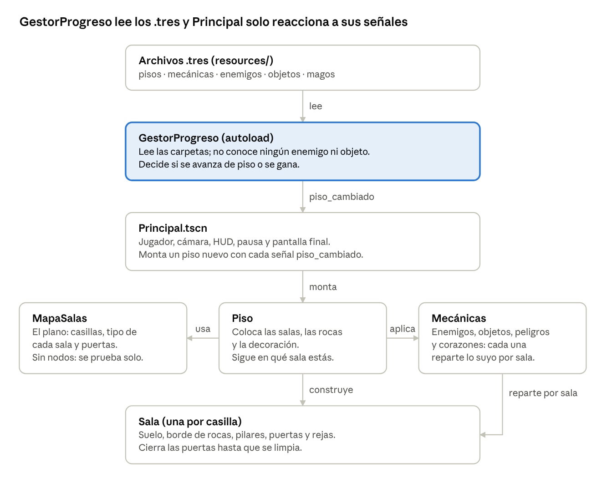

# Vacío — todo lo hecho hasta ahora

Actualizado el 8 de octubre de 2026 · Matías

## Resumen

Vacío se puede jugar de principio a fin. Son 12 pisos, 11 tipos de enemigo y 2 magos para elegir, y desde el 6 de octubre de 2026 hay un `.exe` descargable que se actualiza solo. Es un juego 2D top-down hecho en Godot 4.7 (GDScript) como proyecto de clase de 1.º de DAM, entre 3 personas. Lo empezamos el 17 de septiembre de 2026 y lleva 53 commits en GitHub.

Se baja por las capas de la Tierra, de la corteza al núcleo interno. El rumbo es parecerse a *The Binding of Isaac*:

- Cada piso es un mapa de salas unidas por puertas.
- Al entrar en una sala con enemigos, las puertas se cierran hasta limpiarla.
- Cada piso tiene más salas que el anterior, más pequeñas, y se ve menos.

**Cómo se juega ahora:**

- **Al empezar:** se elige entre el mago oscuro y el mago rojo. Cada uno tiene una ventaja y una pega.
- **Moverse y disparar:** WASD para moverse. Se dispara con las flechas o con clic izquierdo, apuntando con el ratón.
- **Ataque cargado:** mantener el clic derecho o el espacio y soltarlo cuando está cargado. Atraviesa enemigos y hace 3 de daño.
- **Pausa:** Escape (continuar, reiniciar o volver al menú).
- **Enemigos:** salen desde el piso 2. Los de cuerpo a cuerpo son rápidos; los de distancia, lentos pero quitan más vida.
- **Peligros del suelo:** pinchos, agujeros al vacío y lava.
- **Recompensas:** un objeto de mejora por piso. Además, los enemigos sueltan ventajas a veces y, al limpiar una sala, a veces cae un corazón.

**Dónde está:**

- **Código:** [github.com/MatiasRodrigo0502/Vacio](https://github.com/MatiasRodrigo0502/Vacio)
- **Para jugar sin Godot:** [Vacio.exe para Windows](https://github.com/MatiasRodrigo0502/Vacio/releases/latest/download/Vacio.exe) o [Vacio.x86_64 para Linux](https://github.com/MatiasRodrigo0502/Vacio/releases/latest/download/Vacio.x86_64), última versión

## Reglas y forma de trabajar

El proyecto sigue cinco reglas, pensadas para que tres personas trabajen a la vez sin pisarse:

1. **Todo en español:** scripts, clases, variables, funciones, nodos y comentarios.
2. **Los comentarios explican el porqué**, no el qué. Si se descartó una alternativa razonable, se dice por qué.
3. **Ampliar el juego no toca código.** Los pisos, el arte, las mecánicas, los enemigos, los objetos y los magos viven en archivos `.tres`. Añadir uno es crear otro archivo.
4. **Un archivo por unidad de trabajo.**
5. **Se sube a GitHub después de cada cambio terminado.** El repositorio del instituto (`instituto`) se queda atrás a propósito y solo se sube cuando Matías lo pide.

**Cómo se comprueba cada cambio** antes de subirlo:

- Godot se ejecuta sin ventana para importar y sacar errores de los scripts.
- Una escena de prueba temporal monta la partida y mide lo que toque: nodos, distancias, píxeles. Al acabar se borra.
- Las capturas se hacen solo desde dentro del juego, nunca de la pantalla del ordenador.
- Se mide en vez de fiarse de la vista. Tres veces, la impresión visual del contraste fue la contraria a la medición.

**En git:**

- Nunca `git add -A`: se añade cada archivo por su ruta, porque puede haber trabajo de otra persona en la carpeta.
- No se reescribe el historial.

**Para el resto del equipo:** el reparto práctico es que la dificultad se ajusta en `resources/pisos/` (un piso por persona) y una mecánica nueva es un script más un `.tres` nuevos. Las escenas `.tscn` las toca una sola persona cada vez, porque Godot las reordena al guardar.

## Arquitectura

El juego se amplía añadiendo archivos `.tres`, sin tocar código. `GestorProgreso` lee las carpetas sin conocer ningún piso, enemigo ni objeto concreto, y la escena de la partida solo reacciona a sus señales.



Cada pieza vive en su propio archivo, así que tres personas pueden tocar partes distintas a la vez. Los pisos son deterministas: cada reparto usa una semilla del piso, y los 12 pisos salen iguales en los tres ordenadores. Lo único al azar son las ventajas que sueltan los enemigos.

## Cronología

En tres semanas, el juego pasó de una base con obstáculos a un *roguelite* de salas con combate. Esta tabla agrupa los 53 commits por día y tema, de lo más reciente a lo más antiguo.

| Fecha | Qué | Commits |
| --- | --- | --- |
| 08/10/2026 | Rocas de dentro distintas en cada uno de los 12 pisos | — |
| 08/10/2026 | Pared nueva en las salas, distinta en cada uno de los 12 pisos | `22cf64a` |
| 08/10/2026 | Pinchos en el paso de algunas puertas | `9cd37c5` |
| 08/10/2026 | Versión para Linux, en local y en la release | `7b8b204` |
| 08/10/2026 | Atajos de prueba: F1 invencible, F2/F3 piso, F4 limpiar sala | `021a159` |
| 06/10/2026 | Release en GitHub con el `.exe`, rehecha en cada push a `main` | `72de619` |
| 06/10/2026 | `build/Vacio.exe` que se rehace solo tras cada commit y pull | `04e21ef` |
| 30/09/2026 | Bordes de las salas: roca maciza, sombra, pilares y rastrillo que baja | `e779fa0` |
| 30/09/2026 | Corazones que caen al limpiar una sala | `58b857f` |
| 30/09/2026 | Revisión: aviso del HUD, mira del cristal y más respuesta al combate | `13cf00a` |
| 30/09/2026 | Límite de las salas hecho de rocas, más enemigos y ventajas al matar | `f14b207` |
| 29/09/2026 | Agujero del vacío nuevo e iconos de las ventajas en el HUD | `d13944b` |
| 29/09/2026 | Lava y pinchos con arte de verdad | `65d2883` |
| 29/09/2026 | Combate cuerpo a cuerpo y a distancia, slimes que explotan y peligros del suelo | `13a9884` |
| 29/09/2026 | Menú de pausa con Escape | `94ec495` |
| 29/09/2026 | Revisión: tres fallos arreglados | `e3d0107` |
| 25/09/2026 | Arte del manto (pisos 4-8) y pack generado del núcleo (9-12) | `27fc33e` |
| 25/09/2026 | Los siete enemigos dibujados por Matías, al azar por los pisos | `16c63e8` |
| 24/09/2026 | Salas con puertas y minimapa: cada piso es un mapa de salas | `4b735f1`, `cb5a4f6` |
| 24/09/2026 | Mago oscuro en ocho direcciones, elección de mago y mago rojo | `f8681b6`, `c6d0064`, `f16c6d7` |
| 22/09/2026 | Nigromante en cuatro direcciones y ataque cargado | `d0ea1fe` … `dad0f5a` |
| 18/09/2026 | Disparo al estilo Isaac, enemigos como recursos, objetos de mejora, rocas sólidas | `03a6c13` … `007a9ed` |
| 18/09/2026 | Menú principal, primera mecánica (rocas móviles), vida con corazones y `jugar.bat` | `01fd2f6` … `445bb8e` |
| 18/09/2026 | `CLAUDE.md` con el contexto del proyecto y créditos de los packs | `50e67ba`, `d1c8966` |
| 17/09/2026 | Base jugable: 12 pisos, vida, cámara, mago animado, rocas de cueva, tutorial y arte de los pisos 1-2 | `864a79c` … `465e05c` |

## Combate, enemigos y peligros

Los enemigos se reparten en dos tipos de ataque. Los de cuerpo a cuerpo son rápidos (velocidad de 100 a 195). Los de distancia son lentos (0 a 55), pero quitan 2 corazones y avisan antes de cada disparo. Hay 11 tipos, que salen al azar desde el piso 2 entre los que ya pueden aparecer a esa profundidad.

| Enemigo | Ataque | Qué hace |
| --- | --- | --- |
| Slimes (3 tipos) | Cuerpo a cuerpo | Al morir explotan en un área pequeña (radio 70-85) y sueltan dos crías. Las crías no explotan ni se dividen |
| Rata | Cuerpo a cuerpo | Persigue al jugador |
| Murciélago | Cuerpo a cuerpo | De los más rápidos |
| Fantasma | Cuerpo a cuerpo | Persigue al jugador |
| Planta azul | Cuerpo a cuerpo | Persigue al jugador |
| Serpiente | Distancia | Veneno: el jugador va al 60 % de velocidad mientras dura |
| Planta venenosa | Distancia | Veneno, como la serpiente |
| Gólem | Distancia | Lanza magma en parábola, con un aro que marca dónde cae, y deja un charco de lava |
| Cristal | Distancia | Rayo en línea recta. Marca antes la línea, que acaba en la primera roca |

**Cuántos salen:** de media, 3 por sala en el piso 2, y medio más por cada piso, hasta 8 en el 12. Son 378 al empezar los pisos y unas 600 muertes por partida contando las crías. Como mucho, la mitad de cada sala son de distancia.

**Peligros del suelo:** de 1 a 3 por sala de pelea, repartidos sin tapar nunca el paso de una puerta al centro.

- **Pinchos** (desde el piso 2): salen a ratos.
- **Agujeros al vacío** (desde el 3): cuestan un corazón y devuelven a la entrada de la sala.
- **Lava** (desde el 4): hace daño mientras se pisa.
- **Pinchos en las puertas** (desde el 3): en el 40 % de las puertas de las salas de pelea, una placa de pinchos ocupa todo el paso al entrar. Se cruza esperando a que bajen.

**Recompensas:**

- **Objeto de mejora:** uno por piso, en un callejón lejos del camino.
- **Ventajas al matar:** cada enemigo tiene un 3 % de soltar una (entre 9 y 16 por partida en las pruebas). Las crías no sueltan nada.
- **Corazones:** al limpiar una sala, un 25 % de que caiga uno (unos 16 por partida). Con la vida llena no se coge.

**Al recibir un golpe,** la cámara tiembla 7 px durante un cuarto de segundo.

## Arte e interfaz

Cada uno de los 12 pisos tiene su propio arte: la pared que rodea las salas y las rocas de dentro, de la roca de su capa de la Tierra. Todo se genera con scripts de Python del propio proyecto, así que no hay licencias que justificar.

| Piso | Capa | Pared y rocas |
| --- | --- | --- |
| 1 | Corteza continental | Tierra y piedra, con hierba y raíces (hace de tutorial, con carteles en el suelo) |
| 2 | Corteza oceánica | Basalto mojado, con algas y setas que brillan |
| 3 | Litosfera superior | Caliza, con estalactitas y estalagmitas |
| 4 | Astenosfera | Roca que se empieza a fundir, con grietas de magma |
| 5 | Manto superior | Roca verde con cristales de olivino |
| 6 | Zona de transición | Roca violeta con cristales azules de ringwoodita |
| 7 | Manto inferior | Columnas con costuras al rojo |
| 8 | Capa D'' | Escoria negra con ríos de lava |
| 9 | Núcleo externo exterior | Hierro oscuro del que gotea metal fundido |
| 10 | Núcleo externo interior | Placas de hierro y níquel, con astillas de metal |
| 11 | Límite del núcleo interno | Hierro plateado que cristaliza |
| 12 | Núcleo interno | Cristal de hierro al rojo blanco |

Antes se usaban packs de itch.io (de maaot), uno de Matías y otro generado, compartidos entre varios pisos. Siguen en el repositorio, sin usar.

**Generado con scripts:** cada uno da siempre las mismas imágenes, así que el arte se cambia editando el script y volviéndolo a ejecutar.

- **Lava, pinchos y agujero del vacío** (`generar_peligros.py`). La lava lleva además un *shader* con burbujas, en tres variantes.
- **La pared de las salas** (`generar_bordes.py`), distinta en cada piso: la roca de su capa con el canto irregular, la cara de la pared de arriba vista de frente, sus pilares de puerta, adornos encima (hierba, setas, cristales, brasas...), cosas que cuelgan (raíces, estalactitas, gotas de magma o de metal) y salientes grandes (estalagmitas, cristales, columnas). El rastrillo de hierro de las puertas es el mismo en todos.

**Personajes:**

- **Magos:** el mago oscuro, en pixel art y en ocho direcciones, y el mago rojo. Antes se probaron el BlueWizard y el nigromante.
- **Enemigos:** los siete últimos (rata, serpiente, murciélago, gólem, slime de magma, cristal vivo y fantasma) los dibujó Matías.

**Interfaz:**

- **Menú principal:** jugar, controles y salir, con la elección de mago al pulsar Jugar.
- **Menú de pausa** con Escape.
- **HUD:** piso y capa, vida con corazones dibujados por código y, debajo, el icono de cada ventaja recogida («x2» si se repite).
- **Minimapa** arriba a la derecha, con las salas visitadas, el objeto y la bajada.
- **Pantalla final** de victoria o derrota.

## Ejecutable, release y herramientas

El juego se exporta solo a un único archivo por sistema que se abre sin tener Godot: `Vacio.exe` para Windows (unos 110 MB) y `Vacio.x86_64` para Linux (unos 78 MB). Hay dos copias que se mantienen al día sin hacer nada.

| Copia | Dónde | Cuándo se rehace | Quién la hace |
| --- | --- | --- | --- |
| Local | `build/` en cada ordenador | Tras cada commit y cada pull, en unos 15 s | Los hooks de `.githooks/`, que lanzan `herramientas/exportar.sh` |
| Pública | [Release `ultima-version` en GitHub](https://github.com/MatiasRodrigo0502/Vacio/releases/latest) | Tras cada push a `main` que no toque solo archivos `.md` | El workflow `.github/workflows/publicar.yml`, con los mismos scripts |

- **Se puede actualizar con el juego abierto:** la partida abierta sigue y la próxima vez arranca el nuevo.
- **Si una exportación falla,** se queda la versión anterior y el motivo está en `build/exportar.log`, o en la pestaña Actions de GitHub.
- **Windows puede avisar** de que el `.exe` es de un editor desconocido, porque no está firmado: *Más información → Ejecutar de todas formas*.
- **En Linux** hay que darle permiso para ejecutarse antes de abrirlo: `chmod +x Vacio.x86_64`.
- **Comprobado:** una copia de prueba del `.exe` recorrió sola los 12 pisos y llegó a la victoria. El de GitHub mide exactamente lo mismo que el local. La versión de Linux la arranca GitHub antes de publicarla, y no publica nada si da errores.

**Para que un compañero tenga las versiones en su ordenador,** una vez por ordenador:

```bash
python herramientas/instalar_plantillas.py
git config core.hooksPath .githooks
```

El primero baja de la release oficial de Godot solo las plantillas de Windows y Linux (66 MB en vez del paquete entero de 1,28 GB). El segundo activa los hooks, que git no activa solo por seguridad.

**Herramientas del proyecto** (carpeta `herramientas/`):

| Script | Para qué |
| --- | --- |
| `generar_nucleo.py` | Arte de los pisos 9-12 |
| `generar_peligros.py` | Arte de lava, pinchos y vacío |
| `generar_bordes.py` | La pared de las salas de cada piso, sus pilares y la reja |
| `generar_rocas.py` | Las rocas de dentro de cada piso |
| `exportar.sh` | Exportar las versiones de Windows y Linux (a mano: `bash herramientas/exportar.sh`) |
| `instalar_plantillas.py` | Instalar las plantillas de exportación de Windows y Linux |

Para jugar desde el proyecto sin exportar está `jugar.bat`, que abre el juego con un doble clic.

## Fallos arreglados y trampas

Las revisiones encontraron fallos que no se veían jugando un rato. Estos son los más importantes; todos están arreglados y apuntados en `CLAUDE.md` para no repetirlos.

| Fallo | Qué pasaba | Cómo se arregló |
| --- | --- | --- |
| Las rocas nunca paraban las bolas | En Godot 4.7, un `Area2D` no detecta los `StaticBody2D`. Pasaba desde el principio y el código decía lo contrario | El choque con el terreno se calcula a mano en cada paso (`Terreno.choque()`) |
| Reiniciar acumulaba la ventaja del mago | Tres reinicios dejaban al mago rojo con 7 corazones | La ventaja se calcula siempre desde los valores de fábrica |
| Los enemigos solo pegaban al primer contacto | Cuatro segundos con un enemigo encima costaban un corazón | El daño se mira en cada paso mientras se tocan |
| Enemigos dentro de rocas | 38 de 164 salían encima de una roca | Se colocan solo en sitios libres |
| La bola mejorada moría en cualquier roca | Agrandarla con mejoras la dejaba peor | Contra las rocas solo cuenta su núcleo de 10 px |
| El juego saltaba del piso 1 al 3 | Godot avisaba de un choque con la salida del piso anterior | Se comprueba la distancia real a la salida |
| La lava pintaba la textura dos veces | El borde salía negro y el resplandor desaparecía | El color se coge en el `vertex()` del *shader* |
| Cortes rectos en la roca del borde | Las salas en diagonal pintaban su roca encima de la de la otra | Toda la roca se pinta alineada con el mundo, con un fondo único |
| El mago andaba de espaldas | La hoja de sprites rotulaba mal la izquierda y la derecha. Lo pilló Matías jugando | Se midió dónde cae la cara en cada pose |

**Lecciones que se repiten:**

- **Medir antes que fiarse de la vista o de un comentario.** Tres veces el contraste medido fue el contrario al que parecía, y un comentario aseguraba algo que el test desmintió.
- **Nunca `git add -A`.** Un commit del minimapa subió 121 archivos de Matías sin mencionarlos.
- **Lo que se repite al reiniciar tiene que partir de valores fijos.**
- **Al cambiar una regla del juego, revisar los textos que la cuentan.** El menú y el tutorial siguieron diciendo que las rocas quitaban vida mucho después.
- **En el `.exe` exportado, los `.tres` aparecen como `.tres.remap`.** El código que lee carpetas ya lo tiene en cuenta; uno nuevo tendrá que hacer lo mismo.

## Pendiente

Lo más urgente es jugar una partida entera para equilibrar la dificultad, porque nadie la ha jugado todavía de principio a fin y los números se pusieron a ojo el primer día.

**Antes de entregar:**

- [ ] **Equilibrar la dificultad jugando.** Son unas 600 muertes por partida, 9-16 ventajas extra y unos 16 corazones, con 3 o 4 corazones de vida. Todo se ajusta en los `.tres` de `resources/`.
- [ ] **Aclarar de dónde salen las hojas de los magos.** Ni la del mago oscuro ni la del rojo traen autor; son los únicos assets así.
- [ ] **Verificar las licencias de lo que queda de fuera.** Los escenarios ya son todos propios; de fuera quedan los magos (ver el punto anterior). Los packs de itch.io de antes ya no se usan.

**Decide Matías:**

- [ ] **Borrar las carpetas de personajes que ya no se usan:** `mago/`, `nigromante/` y `personaje/`. El historial de git las conserva.

**Ideas no pedidas todavía:**

- Sonido y música (el juego no tiene).
- Una sala de jefe en el piso 12.
- Una textura sutil para el suelo.
- Oscurecer las salas vecinas que asoman cuando la vista es más grande que la sala.
- Salas de otras formas.
- Puntuación y guardado de partida.
